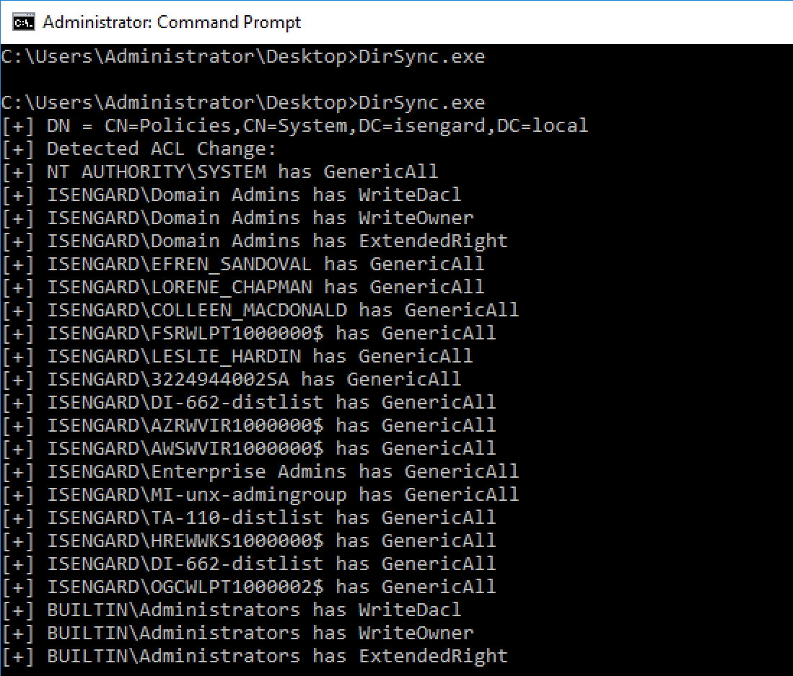

# DirSync PoC

An extremely unsexy PoC of a software that uses the DirSync protocol to poll Active Directory for changes.

So it turns out that there are multiple ways of polling Active Directory for changes, this repository is meant to explore the method called "DirSync".

Example of output after granting someone privileges to add Group Policies:

This you might have noticed:

- You don't see the exact attribute that was modified
- You don't see who performed that action
- ACL parsing logic was completely stolen from SharpHound. Life is too short.

So how can you use this?

- Detecting persistence 

- General AD hygene

  